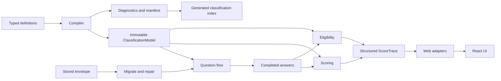

# Classification Architecture and Staged Migration Design

- **Status:** Approved
- **Direction approval:** Staged monorepo migration approved by the user on 2026-07-11
- **Written specification approval:** Approved by the user on 2026-07-11
- **Repository:** `AnsonHui6040/ramen-style-today-next`
- **Legacy baseline:** `AnsonHui6040/ramen-style-today@eebf00b7ddfbbe6f01ff598e57f1e17197068a37`
- **Date:** 2026-07-11

## 1. Objective

Rebuild the low-level classification architecture without redesigning the already-understood user flow. The new system must make classification definitions easier to change, make errors precise and early, and give future Codex work a trustworthy index from each concept to its canonical source, runtime consumer, migration impact and tests.

The migration is a new public monorepo with a clean Git history. The legacy repository remains production and the behavioral oracle until every cutover gate passes.

## 2. Success criteria

The architecture is successful only when all of the following are true:

1. A question, option, style, score policy or exclusion is defined in one canonical hand-authored location.
2. Core types and noodle variants that follow a pattern are compiled rather than manually repeated.
3. Invalid structure, references and semantics fail before application build with aggregated, path-specific diagnostics.
4. Every score and block decision can be reconstructed from a structured trace with stable rule IDs and model versions.
5. Persisted answers use an explicit schema version and deterministic migration chain; restored progress is always finishable or repaired to the first actionable question.
6. Ranking and catalog selection are deterministic and independent of source-file order.
7. A generated Markdown index and JSON manifest map concepts to definitions, consumers, migrations, messages and tests, and CI rejects documentation drift.
8. Migration batches prove legacy parity before later layers depend on them.
9. The legacy production deployment remains untouched until a separate cutover decision.

## 3. Non-goals

This redesign does not introduce a backend, account system, telemetry, collaborative filtering, live restaurant ingestion, content-management UI, package publication or a new visual design. It does not claim that style-level exclusion tags are an allergy guarantee. Those product changes require separate designs after architecture parity.

## 4. Repository topology

```text
ramen-style-today-next/
├── apps/
│   └── web/
│       ├── src/app/                    composition and page flow
│       ├── src/features/               questionnaire, results and Finder UI
│       ├── src/adapters/               storage, catalog and Finder adapters
│       ├── src/i18n/                   stable-message translations
│       └── src/data/                   web-only catalog and map data
├── packages/
│   └── classification-core/
│       ├── src/contracts/              public IDs, types and result contracts
│       ├── src/definitions/            canonical questions, policies and styles
│       ├── src/compiler/               structural and semantic compilation
│       ├── src/flow/                   pure questionnaire navigation
│       ├── src/scoring/                pure scoring, ranking and trace
│       ├── src/eligibility/            strict exclusion evaluation
│       ├── src/persistence/            envelopes, migration and repair
│       └── src/index.ts                the only supported consumer entrypoint
├── tools/
│   ├── migration/                      legacy import and provenance tools
│   ├── parity/                         old-versus-new comparison harness
│   └── documentation/                  relation registry, index and manifest generation
└── docs/
    ├── architecture/
    ├── classification/
    ├── decisions/
    ├── migration/
    └── superpowers/
```

The root uses npm workspaces only. Turborepo, Nx and package publishing are excluded until repository scale proves they are needed.

## 5. Dependency direction



`classification-core` has no dependency on React, DOM APIs, localStorage, localized rendering, catalog data or map data. The package exposes two intentional entrypoints: `@ramen-style/classification-core` for runtime consumers and `@ramen-style/classification-core/compiler` for migration, validation and documentation tools. `apps/web` may use only the runtime entrypoint. Nothing imports from `apps/web`.

## 6. Canonical definitions

### 6.1 Question model

`definitions/questions.ts` declares ordered question IDs, answer cardinality, option IDs, exclusive options, dependencies and availability conditions. Flow is based on explicit question IDs and compiled dependencies, never `stepIndex` ranges or assumptions that a certain question is last.

The compiler builds a dependency graph and rejects:

- missing or duplicate IDs
- cycles
- a dependency on a later or unreachable answer
- empty branches
- impossible completion paths
- selection bounds inconsistent with selection type
- exclusive options that can coexist with ordinary selections
- scored questions whose weights are missing or invalid

### 6.2 Option taxonomy

Option IDs are declared once and inferred into TypeScript literal types. A classification option includes a stable ID and stable message IDs; translated sentences are not identities. Source-flavor signals and strict exclusion tags use separate types even when their visible wording is related.

### 6.3 Style definitions

Each display style owns one focused file named after its stable style ID. It declares display metadata, family, base matching rules, explicit bonuses and conflicts, exclusion tags and intensity overrides.

The hand-authored style definition does not repeat three complete core types or five noodle variants. The compiler expands:

- one core per supported intensity
- intensity-specific body rules and other explicit overrides
- one subtype for each supported noodle shape
- deterministic IDs derived from the stable style, intensity and noodle IDs

Generated IDs are validated for global uniqueness and parent-child consistency. Generated summaries use stable message templates, not copied prose.

### 6.4 Scoring policy

`definitions/policies.ts` is the only source for question weights, tier ratios, bonus and penalty budgets, confidence normalization, low-confidence thresholds and tie-break priority. Runtime scoring and semantic validation consume the same compiled policy.

The initial policy preserves the legacy values. Any later numerical change requires a model-version change, an Architecture Decision Record and separately approved behavior fixtures.

### 6.5 Version semantics

Three versions have distinct responsibilities:

- `schemaVersion` identifies the persisted answer payload shape and selects the migration chain. The first new envelope is schema version 1.
- `modelVersion` identifies behavior-affecting taxonomy, flow, eligibility and score-policy semantics.
- `dataVersion` is a deterministic fingerprint of the compiled definitions and adapter inventories used to produce a result.

A content-only correction changes `dataVersion`. A change that may alter completion, ranking, blocking or confidence changes `modelVersion`. A stored shape change increments `schemaVersion`, even when the resulting classification behavior remains equivalent. The compiler emits the immutable manifest under both `modelVersion` and `dataVersion`, and parity artifacts retain its checksum so a trace can be matched to the exact manifest that produced it.

## 7. Compilation and runtime validation

TypeScript definitions provide editor-level checking. Zod runtime schemas parse imported legacy JSON, persisted browser data and generated manifests as `unknown`. Custom semantic validators run after structural parsing.

Compilation follows one deterministic pipeline:

1. parse structural contracts
2. normalize canonical definitions without changing stable meaning
3. validate references and dependency graphs
4. validate scoring and eligibility semantics
5. expand generated core types and subtypes
6. build immutable lookup indexes
7. emit the model, inventory and diagnostics

No config module may cast untrusted data into a domain type before parsing.

## 8. Structured diagnostics

Every diagnostic has this contract:

```ts
interface Diagnostic {
  severity: 'error' | 'warning'
  code: string
  sourceFile: string
  path: string
  entityId?: string
  message: string
  expected?: unknown
  received?: unknown
  related?: readonly DiagnosticReference[]
}
```

Codes are stable and grouped by responsibility, for example `QUESTION_DUPLICATE_ID`, `FLOW_CYCLE`, `RULE_UNKNOWN_OPTION`, `STYLE_FAMILY_MISMATCH`, `POLICY_BUDGET_MISMATCH`, `MIGRATION_UNHANDLED_VERSION` and `DOC_INDEX_DRIFT`.

`sourceFile` uses a repository-relative POSIX path for file-backed data. Runtime-only sources use a reserved URI such as `runtime://local-storage/legacy-state`; absolute machine paths are forbidden. `path` uses RFC 6901 JSON Pointer. Diagnostic codes are declared once in the core contract registry, and tests must fail if a validator emits an undeclared code.

Validation aggregates independent errors and sorts them by source file, path and code. CLI output is concise for people, while JSON output preserves the complete structure for Codex and CI.

## 9. Questionnaire flow and answer contracts

The flow engine is pure and receives only a compiled model plus an answer draft. It returns the next interactive question, allowed options, forced answers, completion status and any repairs. React stores state but does not decide domain transitions.

Core answer types are:

- `AnswerDraft`: normalized partial answers
- `CompletedAnswers`: answers proven complete for one model version
- `FlowState`: current question ID and reachable question sequence
- `RestoreResult`: repaired draft, resume question ID, source version and structured repair events

Final validation never fails silently. An invalid draft returns a diagnostic and the first question requiring action.

## 10. Persistence and migrations

The core package owns only the classification payload:

```ts
interface StoredClassificationPayload {
  schemaVersion: number
  modelVersion: string
  dataVersion: string
  currentQuestionId?: QuestionId
  answers: unknown
}
```

The web adapter wraps that payload with application-only state:

```ts
interface WebStoredEnvelope {
  savedAt: string
  phase: 'intro' | 'questions' | 'results'
  locale: Locale
  classification: StoredClassificationPayload
}
```

Core migrations are pure, sequential functions such as `v1ToV2`. They migrate only classification data and return it with stable repair events. The web adapter separately restores phase and locale without introducing them into the core domain. Unknown future versions are rejected safely. The old key name ending in `.v1` is not treated as a payload version: its payload is identified as `legacy-unversioned` and migrated through `legacyUnversionedToV1`. The existing broad `seafood` exclusion migration remains covered.

After migration, the flow engine recomputes reachability and resumes at the first missing or invalid interactive question. No saved snapshot may leave a user at the final question with an unfinishable earlier answer.

The new app reads `ramen-style-today.state.v1` only as a legacy source and never overwrites or deletes it. Successfully migrated data is validated completely before a separate `ramen-style-today-next.state.v1` value is written. A parse, migration or validation failure sets persistence mode to `quarantined`, disables autosave, preserves the raw source value and offers an explicit restart/export path. Autosave is enabled only after a valid target envelope exists.

## 11. Scoring, eligibility and traceability

Scoring is a pure function of `ClassificationModel` and `CompletedAnswers`.

Each result includes a `ScoreTrace` containing:

- model and data versions
- style, core and subtype IDs
- one line per scored question with answer values, matched values, rule ID, tier, ratio, weight and points
- bonus and penalty adjustments with stable IDs, matched conditions and awarded points
- pre-adjustment and final totals
- deterministic ranking keys
- eligibility decisions and exclusion tags

The engine asserts that the final total equals base points plus bonuses minus penalties. Confidence derives its maximum from the compiled policy rather than a hard-coded denominator.

Within a display style, core candidates are ordered by score descending, compiled core priority ascending, then core ID ascending. The initial core priority preserves the legacy intensity order `clean`, `standard`, `heavy`. The compiler requires every valid noodle answer to resolve to exactly one generated subtype; a missing or duplicate subtype is a compilation error, not a runtime fallback.

Across display styles, ranking is final score descending, configured display priority ascending, then stable style ID ascending. During parity migration, display priority is seeded from the frozen legacy source order so an existing tie does not silently change. Catalog adapters similarly encode the frozen legacy item/store order as explicit priority before later redesigns are considered.

Eligibility remains separate from taste scoring. The first parity migration preserves current style-level blocking, represented as `exclusionTags`. The UI continues to state that this is not an allergy guarantee. Item-level ingredient safety is a later product design.

## 12. Localization and adapters

Core results carry stable message IDs and structured values; they do not carry translated identity strings. `apps/web/src/i18n` resolves zh-TW, English and Japanese text and has completeness tests for every required key.

Catalog and Finder adapters:

- validate all referenced style, core, subtype and Finder IDs
- own deterministic ordering rules
- return structured match reasons using message IDs
- cannot modify core score or eligibility

The current Finder profile bridge moves out of the React component into a validated adapter definition.

## 13. Documentation and Codex index

The repository maintains two generated, tracked artifacts:

- `docs/classification/index.md` for human and Codex navigation
- `docs/classification/manifest.json` for machine-readable inventory and checksums

Each concept entry records:

| Field | Meaning |
| --- | --- |
| ID and kind | question, option, style, core, subtype, rule, exclusion, policy or adapter code |
| Canonical source | exact hand-authored file |
| Generated owner | compiler output path or runtime index |
| Consumers | flow, scoring, persistence, UI, catalog or Finder |
| Message IDs | localized copy dependencies |
| Migration impact | stored schema and prior IDs |
| Tests | exact contract, fixture, parity and UI tests |

`tools/documentation` regenerates both artifacts. CI fails if regeneration produces a diff. A hand-authored `docs/classification/change-map.md` explains the correct workflow for common changes. Generated files clearly state that they must not be edited directly.

`tools/documentation/relations.ts` is a typed registry for semantic relationships that cannot be derived reliably from definitions alone: migration impact, message ownership and intentional adapter mappings. The generator also scans the TypeScript import graph and test coverage declarations. CI checks both directions: every registry ID and path must exist, every detected core consumer must be registered, every public concept must have a validator and test declaration, and the registry, generated manifest and generated Markdown must agree. A no-diff regeneration by itself is not considered sufficient completeness evidence.

Architecture Decision Records capture changes to stable boundaries, ID policy, score policy, migration semantics, dependencies and cutover rules.

## 14. Test strategy

### Contract tests

Every structural, referential and semantic diagnostic code has at least one mutation test. Tests assert diagnostic codes and paths, not only English message text.

### Flow and migration tests

Fixtures cover every branch edge, forced option, exclusive option, selection limit, legacy payload version, missing answer and invalid saved current question. Every restored fixture must either be complete or identify a valid resume question.

### Scoring tests

- at least one canonical ranking fixture for each of the 18 display styles
- rule coverage proving each exact, adjacent, partial and miss tier is reachable where declared
- bonus, penalty, cap, confidence and deterministic tie boundary tests
- invariant tests proving trace arithmetic and reorder independence
- exclusion fixtures for every supported strict exclusion tag

### Parity tests

The parity harness stores frozen legacy input/output fixtures generated from `eebf00b7ddfbbe6f01ff598e57f1e17197068a37` under `tools/parity/fixtures/legacy-v1/`. The fixture manifest records its schema, generator version, complete baseline environment and ordered case IDs. The fixtures and provenance are committed to the new repository and must not be edited by hand; CI does not dynamically depend on a neighboring legacy checkout. A separate extraction tool may regenerate them only when pointed explicitly at the verified baseline and must reject baseline or lockfile mismatches. The harness compares display order, core, subtype, points, confidence, low-confidence state, blocks and recommendation order. A compiler-generated coverage corpus exercises every question branch and every declared scoring tier without attempting an unbounded Cartesian product.

Intentional behavior changes require an approved fixture diff and ADR; they cannot be hidden inside structural migration.

### Web tests

Component and browser tests cover the representative questionnaire paths, resume and repair flows, locale switching, result explanation, exclusion notice, catalog results, Finder mapping, keyboard navigation and mobile overflow.

## 15. Required verification gates

The implementation plan must provide root commands with these responsibilities:

- lint all workspaces
- run all unit and component tests once
- typecheck and build all workspaces
- compile and validate classification definitions
- regenerate and check the classification index and manifest
- run legacy parity
- run the web browser smoke path when the web app exists

CI runs the same gates. A narrow package test cannot prove a repository-wide migration batch complete.

## 16. Migration batches

### Batch 0: Repository and design foundation

Create the public repository, rights notice, tracked `AGENTS.md`, this design and the frozen legacy baseline. No application code is migrated.

### Batch 1: Contracts, diagnostics and compiler shell

Create npm workspaces and the core package. Implement public IDs, Zod structural schemas, diagnostic aggregation, immutable compiled model contracts and initial index tooling. Use small synthetic definitions only; production data remains legacy-owned.

### Batch 2A: Questions and flow

Migrate question and option definitions, compile dependencies, implement pure flow, and prove branch, option and completion parity.

### Batch 2B: Persistence and repair

Add the core payload, web envelope, read-only legacy source, sequential migrations, quarantine behavior and resume repair. Prove every stored fixture is complete or returns a valid actionable question.

### Batch 3A: Style compilation

Convert each legacy style into one compact typed definition and generate deterministic core/subtype expansions. Prove inventory, ID and compiled-rule parity without introducing runtime ranking.

### Batch 3B: Scoring and trace

Implement the central score policy, deterministic collapse/ranking, confidence and structured trace. Meet full numerical and ordering parity plus arithmetic and reorder invariants.

### Batch 3C: Eligibility

Implement strict exclusion evaluation separately from score, migrate all supported tags, preserve blocked-lead behavior and prove exclusion parity.

### Batch 4A: Catalog adapter

Migrate only relevant catalog data, add reference validation and explicit legacy ordering, and prove recommendation parity. Do not copy historical outputs or unrelated assets.

### Batch 4B: Finder adapter

Migrate the relevant map data and Finder profiles, move the style bridge out of React, validate both taxonomies and preserve current filtering behavior.

### Batch 5A: Web shell and questionnaire

Build the React consumer against the core runtime entrypoint and migrate the intro, questionnaire, navigation and persistence adapter.

### Batch 5B: Results and localization

Migrate results rendering and all zh-TW, English and Japanese messages by stable message ID. Prove result meaning, score display and localization completeness.

### Batch 5C: Web integrations and browser quality

Connect catalog and Finder adapters, then verify representative end-to-end paths, keyboard behavior, accessibility semantics and mobile overflow.

### Batch 6: Cutover readiness

Run all repository gates, compare production behavior, review documentation and rights, deploy a separate preview and request explicit cutover approval. The old deployment remains unchanged until that approval.

## 17. Batch acceptance rule

Each batch must end with:

1. an independently useful deliverable
2. exact entries in canonical `docs/migration/ledger.json`; Batch 1 adds schema validation and generated `docs/migration/ledger.md`
3. complete verification output
4. regenerated indexes with no drift
5. clean Git status
6. a focused commit or reviewable pull request

A later batch cannot compensate for missing evidence in an earlier batch.

## 18. Failure handling

- Compiler errors prevent model creation and application build.
- Runtime receives only a successfully compiled immutable model.
- Persistence failure leaves the questionnaire usable and reports that progress cannot be saved.
- Migration failure preserves the original stored payload, enters quarantined read-only persistence mode, returns a diagnostic and offers safe restart/export paths.
- Missing localization keys fail tests and use a controlled product-safe fallback in production; internal IDs never become visible copy.
- Adapter failures cannot change the classification result; catalog or Finder sections degrade independently.

## 19. Cutover criteria

Production cutover may be proposed only when:

- all legacy contract and parity fixtures pass
- all 18 styles have canonical coverage
- no unresolved error-severity diagnostics exist
- storage migration from the legacy browser payload is verified
- catalog and Finder references validate
- generated documentation has no drift
- lint, tests, typecheck, build and browser smoke checks pass
- the new preview has no blocking accessibility or mobile-layout regression
- the user explicitly approves cutover

Until then, `ramen-style-today` remains the production repository and `ramen-style-today-next` remains a parallel migration.
